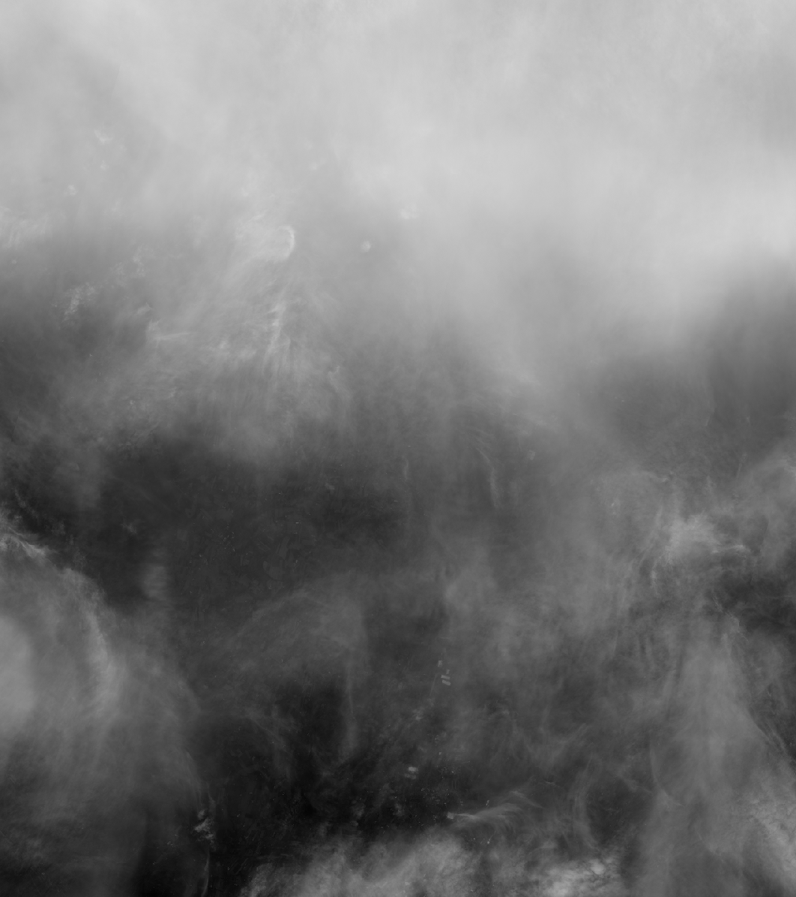
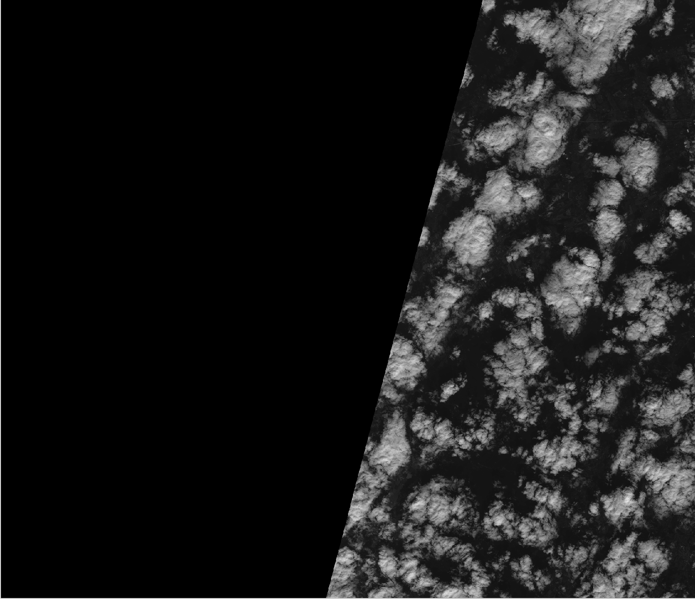
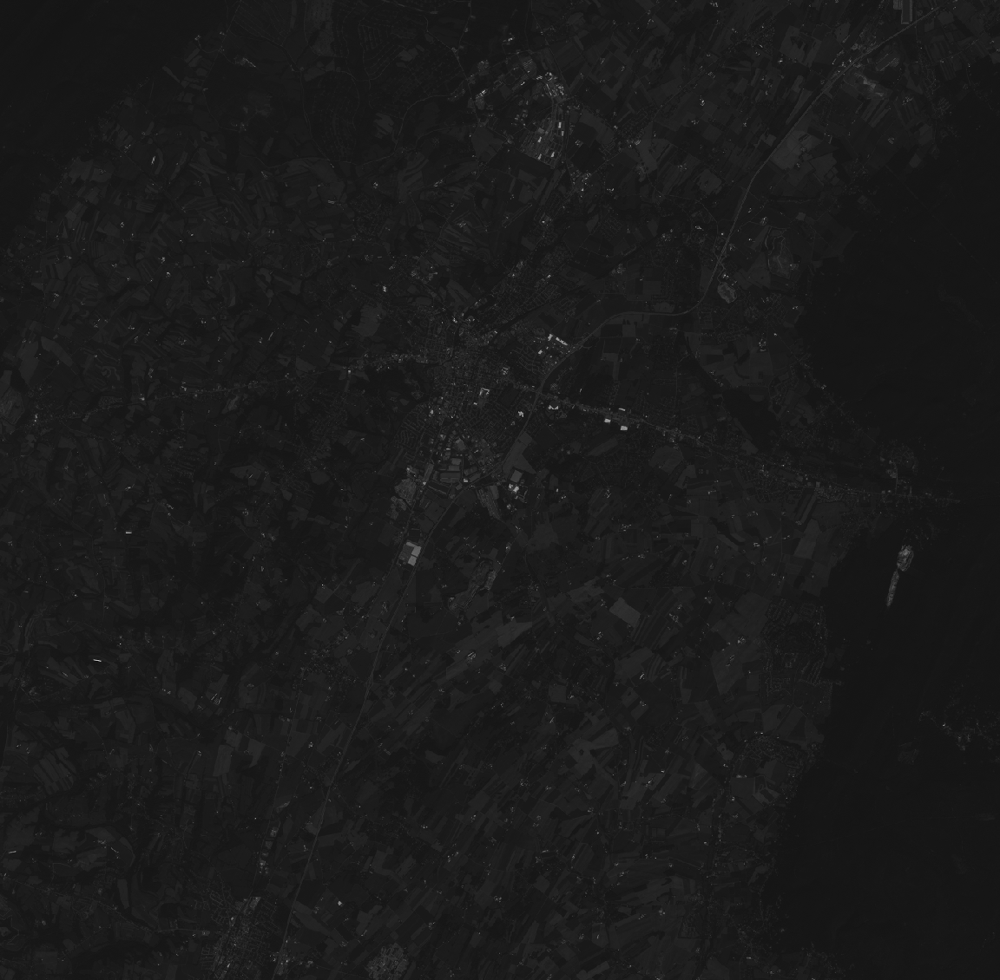
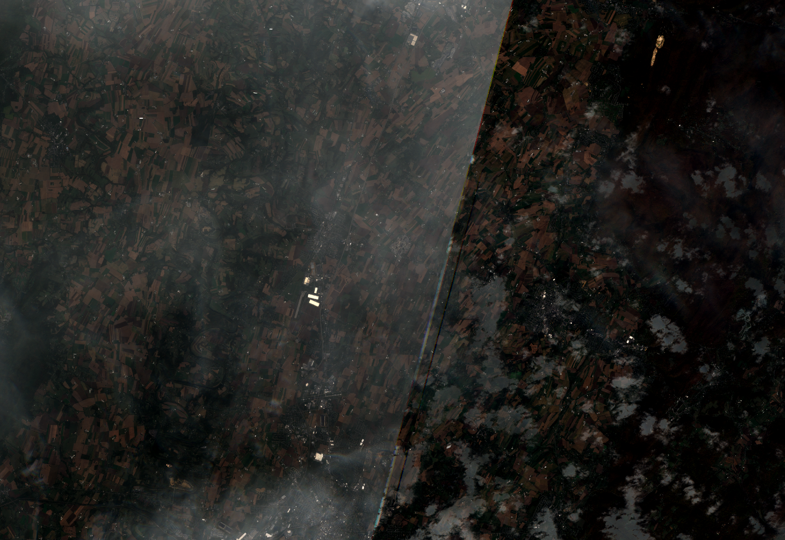

## Example Program Output

Running `s2_mosaicker` with parameters:

- tile_id: `18TTK`
- start: `2020-10-10T02:44:33.000000Z`
- end: `2020-10-28T02:44:33.000000Z`

We pull down 8 images. We can see that in some areas of these images we have entire sections of 0 intensity values and clouds that make the images difficult to interpret.

Below are some examples of problematic images (of individual bands). Note that we are zoomed into
areas of interest. 

Cloudy:

#

Dark regions:

#

Here is an example of a 'clearer' image:

#

However, after running our program we can see here that the opacity of the clouds is reduced and we no longer have the leftmost area with the dark pixels. Although we can see where that area was with 
the edge present on the screen.

#

The final tiff file that was used in the above image is located in: images/final.tiff. 
The final tiff still has clouds present, so we would need to increase our time range and
pull in more data.

Note: All images were viewed on QGIS.

