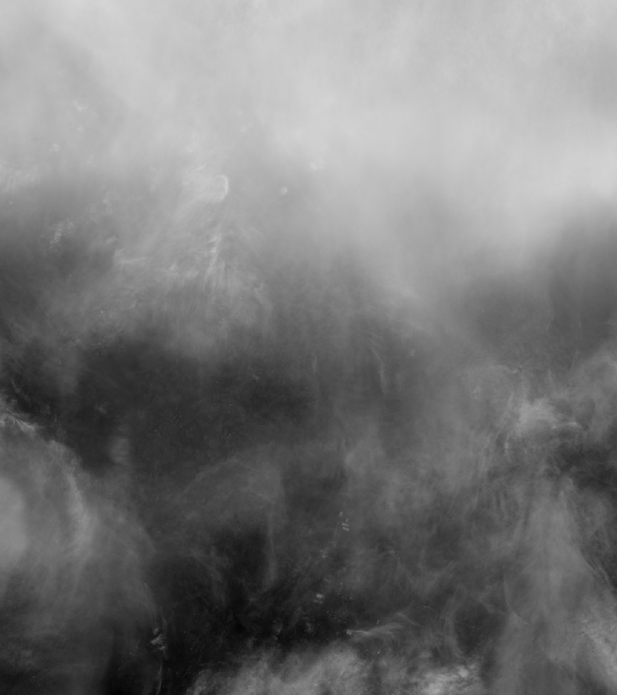
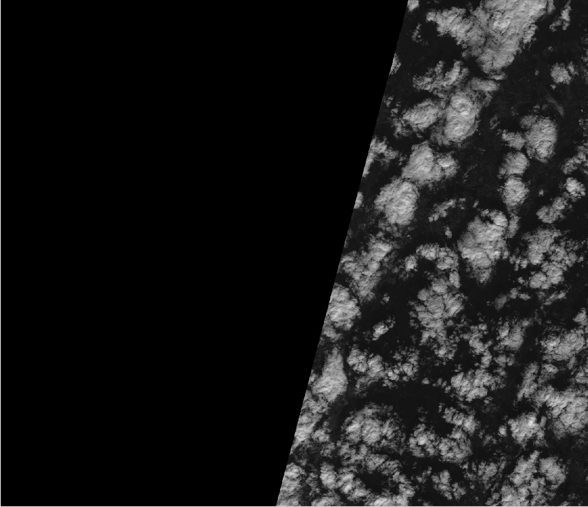
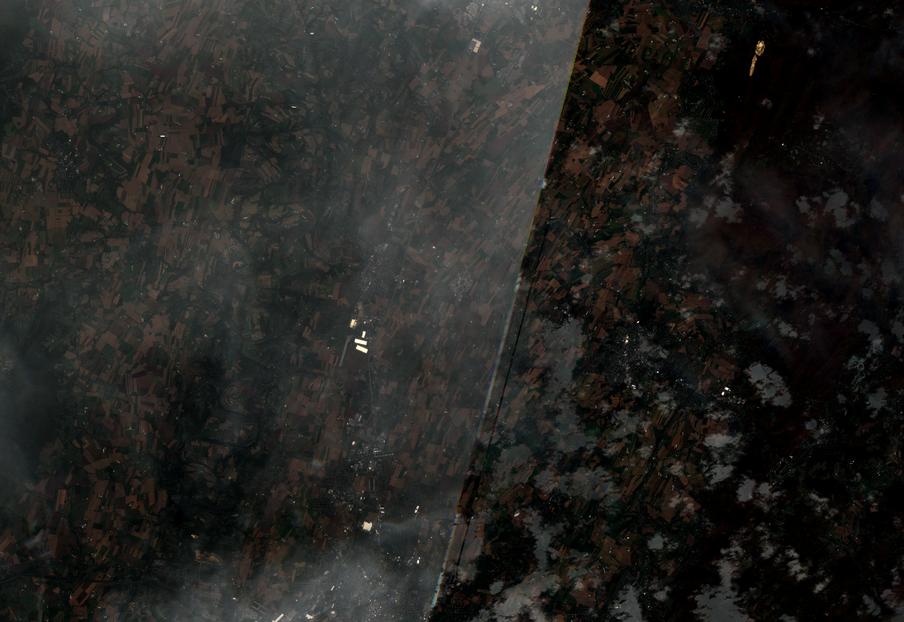

## Example Program Output

For tile_id: `18TTK`

And for 9 images between: `2020-10-2` to  `2020-10-27`

We can see that some of these images have areas with 0 intensity values and clouds that make the images difficult to interpret.

Below are some examples of problematic images (of individual bands):

Cloudy:

#

Dark regions:

#

Here is an example of a 'clearer' image:

#

However, after computing the median we have our final image:

#

Note: All images were viewed on QGIS.

